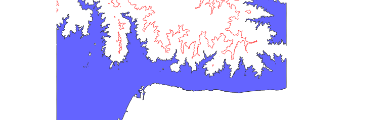

El objetivo de este ejercicio es la creación de una animación en la que se visualiza el efecto de un aumento del nivel del mar en la costa de Málaga, con un incremento de 0 a 100 metros, con un frame cada metro.

En esta [animación](https://www.youtube.com/watch?v=0ZnI-Y90F4s) puede verse el resultado.

[](https://youtu.be/0ZnI-Y90F4s)

Para ello será necesario crear un [script](inundado.py) a ejecutar en la consola de Python de QGIS, en la que se utiliza la librería GDAL para obtener la curva de nivel.

Para generar una única curva de nivel a, por ejemplo, 28m de elevación, se especifica que se dibuje una curva de nivel cada 10000 metros de elevación (INTERVAL), comenzando por la curva a 28m (OFFSET)

El parámetro -p de ```gdal_contour``` es el que permite crear dos polígonos en lugar de una línea. El script descarta uno de los dos polígonos, y colorea de azul el primero.

