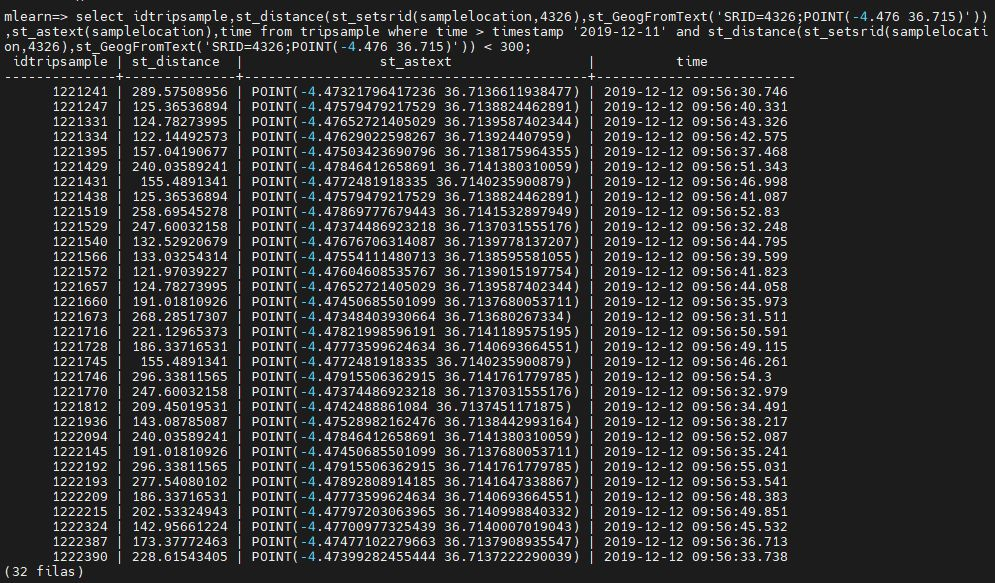

___

# Lesson 4. PostGIS in depth

En la lección 3 aprendimos los conceptos básicos de una base de datos geográfica, y en particular, de la extensión GIS de postgresql. El objetivo de esta lección es profundizar en el conocimiento de la base de datos. Pero antes de empezar, repasamos algunos aspectos de las bases de datos.

<br/><br/>
___

## MLearn: Una base de datos para practicar:

Para acceder a la base de datos, necesitará los siguientes datos de conexión:

Servidor: obd.ac.uma.es
Usuarios: ml_aa00, ml_aa01
Password: ******** (preguntar)
Database: mlearn

Puede evitar la solicitud de contraseña mediante la creación de un archivo /users/username/.pgpass con tantas líneas como conexiones desee, siendo cada linea de la forma:

```obd.ac.uma.es:5432:mlearn:ml_aa02:********```

(en gitignore hay un ejemplo)

El archivo debe tener permisos 0600:

```sh
chmod 0600 .pgpass
```


Establezca una conexión con la base de datos mediente el front-end interactivo para base de datos PostgreSQL

```psql -h obd.ac.uma.es -U ml_aa00 –d mlearn```


<br/><br/>
___

## Comandos psql

Una vez dentro de la ventana de comandos de psql, podemos ejecutar consultas a la base de datos, o bien comandos de la propia aplicación:


- `\?`: Show help (list of available commands with an explanation)
- `\q`: Quit/Exit
- `\c __database__`: Connect to a database
- `\l`: List databases
- `\d __table__`: Show table definition (columns, etc.) including triggers
- `\d+ __table__`: More detailed table definition including description and physical disk size

Most `\d` commands support additional param of `__schema__.name__` and accept wildcards like `*.*`


- `\dy`: List events
- `\df`: List functions
- `\di`: List indexes
- `\dn`: List schemas
- `\dt *.*`: List tables from all schemas (if `*.*` is omitted will only show SEARCH_PATH ones)
- `\dT+`: List all data types
- `\dv`: List views
- `\dx`: List all extensions installed
- `\df+ __function__` : Show function SQL code. 
- `\x`: Pretty-format query results instead of the not-so-useful ASCII tables
- `\copy (SELECT * FROM __table_name__) TO 'file_path_and_name.csv' WITH CSV`: Export a table as CSV
- `\des+`: List all foreign servers
- `\dE[S+]`: List all foreign tables
- `\! __bash_command__`: execute `__bash_command__` (e.g. `\! ls`)

User Related:
- `\du`: List users
- `\du __username__`: List a username if present.
- `create role __test1__`: Create a role with an existing username.
- `create role __test2__ noinherit login password __passsword__;`: Create a role with username and password.
- `set role __test__;`: Change role for current session to `__test__`.
- `grant __test2__ to __test1__;`: Allow `__test1__` to set its role as `__test2__`.
- `\deu+`: List all user mapping on server


<br/><br/>
___

## Las tablas de las bases de datos de las prácticas

En las prácticas, utilizaremos fundamentalmente tres tablas:

* Calles de Málaga (streetlines)
* Viajes de vehículos (trip)
* Muestras durante un viaje (tripsample)

Estas tablas están obtenidas del proyecto USmartDrive, que se detalló en la primera lección, pero que se resume en este video:

[](https://vimeo.com/766531623)

Pero nada como ver el contenido de las tablas para entender la información que contiene:

<br/><br/>
___

## Visualización de tablas geográficas

Antes de continuar con la práctica, consultemos su estructura (\d trip) y visualizaremos, mediante cuatro técnicas diferentes, los datos de las tablas:


<br/><br/>
### Modo 1: Visualización elemental, en modo texto (psql)

select idtripsample,samplelocation,time from tripsample where time > timestamp '2019-12-11';

Observamos que la representación de los datos geográficos se muestra en binario, en formato [WKB](https://en.wikipedia.org/wiki/Well-known_text_representation_of_geometry#Well-known_binary):

01 01000000 00000060ABC611C0 00000000A35B4240
<pre>
01: little endian
01 00 00 00:  32bit integer 0001 (Point data, en little endian)
00000060ABC611C0: Coordenada X, flotante de 8 bytes -4.4440131187439
00000000A35B4240: Coordenada Y, flotante de 8 bytes 36.7159118652344
</pre>
Para obtener una representación legible de las coordenadas de los puntos, en formato [WKT](https://en.wikipedia.org/wiki/Well-known_text_representation_of_geometry), utilizaremos una conversión:

select idtripsample,st_astext(samplelocation),time from tripsample where time > timestamp '2019-12-11';



Como se observa, hemos introducido un operador nuevo (st_astext). Este tipo de operadores espaciales (st procede de Spatial-Type) son funciones disponibles al incorporar la extensión GIS. Veremos algunos de ellos en los siguientes ejemplos.

<br/><br/>
### Modo 2: Visualización mediante PGAdmin

[PGAdmin](https://www.pgadmin.org/download/pgadmin-4-windows/) es una herramienta de administración de bases de datos postgresql, similar a la muy conocida phpmyadmin. Visualizamos los datos en las tablas mediante la selección de la tabla y la ejecución de una consulta. Como primera opción usaremos la opción view/edit data de una tabla como inputdata.tripsample. En la tabla, localizamos la columna geométrica, y veremos un icono a la izquierda del nombre que permite visualizar la geometría.


Después, ejecutaremos la siguiente consulta mediate la opción _query tool_ de la tabla:

```sql
select idtripsample,st_setsrid(samplelocation,4326),time from tripsample 
where time > timestamp '2019-12-11' and 
st_distance(st_setsrid(samplelocation,4326),st_GeogFromText('SRID=4326;POINT(-4.476 36.715)')) < 300;
```

En este caso hemos utilizado tres operadores geográficos:

1 [st_setsrid](https://postgis.net/docs/ST_SetSRID.html), que asigna el CRS WGS84 a los datos procedentes del GPS, ya que se almacenaron sin un CRS asignado

2 [st_geogfromtext](https://postgis.net/docs/ST_GeogFromText.html),  que se ha utilizado para crear un dato geográfico a partir de texto en formato [EWKT](https://en.wikipedia.org/wiki/Well-known_text_representation_of_geometry), donde la E de extendido implica que contiene un CRS.

3 [st_distance](https://postgis.net/docs/ST_Distance.html), para calcular la distancia geodésica, en metros, entre dos datos geográficos, o entre dos geométricos (ya veremos que no es lo mismo). En este caso hay un casting implícito en el primer operando, de geométrico a geográfico.

Al visualizar la geometría, en este segundo caso, aparece una capa OpenStreetMap de fondo, que es una consecuencia de que la segunda columna tiene establecido un SRC, permitiendo geoproyectarla correctamente. Comprobamos asimismo que los datos visualizados se corresponde con un trayecto que transcurre a menos de 300 metros del punto _SRID=4326;POINT(-4.476 36.715)_ (situado en el centro del aparcamiento del Complejo Tecnológico)


<br/><br/>
### Modo 3: Visualización con QGIS

En este caso, nos bastaría con agregar la conexión a la base de datos en el Panel Browser, introduciendo los [parámetros](#mlearn-una-base-de-datos-para-practicar), y arrastrar la tabla geográfica que nos interese al lienzo, o al panel de capas. La única tabla correctamente georeferenciada (con un SCR de referencias preestablecido es _streetlines_), por lo que será la que usemos en este caso como primer ejemplo.


<br/><br/>
### Modo 4: Visualización con DB Manager de QGIS

Finalmente, instalaremos el plugin de QGIS denominado DB Manager, y veremos que aparece una opción en el menú principal para realizar operaciones sobre una base de datos.


<br/><br/>
___

# Consultas básicas con POSTGIS

Antes de adentrarnos en algunas interioridades propias de la componente QGIS de PostGIS, recordaremos algunos conceptos generales de las bases de datos:

Y no está de más hacer un backup previo...

pg_dump -a  -h obd.ac.uma.es -U ml_admin  -d mlearn > archivo.sql

Empecemos por lo más básico (create, drop, select)

```sql
create USER pepe WITH password 'juan';
drop USER pepe;
create database midb;
drop database midb;
create table tabla as select idtrip as id from trip;
select * from tabla;
drop table tabla;
```
Ahora, unos operadores elementales (promedio, suma):

```sql
select avg(distance) from trip;
select idtrip+distance from trip;
select 'id= ' || idtrip::varchar from trip;
```

<br/><br/>

## Extensión GIS a los datos de PostgreSQL

PostGIS proporciona dos formas diferentes para el almacenamiento de datos geoespaciales: 

* Geometry, que asume que todos los datos se sitúan en un plano cartesiano (como la proyección de un mapa); 
* Geography, que asume que todos los datos se sitúan en la superficie terrestre, o más bien un esferoide, especificado por sus latitudes y longitudes.

En realidad, las geometrías ya existían en PostgreSQL sin la extensión GIS.

Intente averiguar los resultados de la distancia geométrica entre las playas de El Palo y Mata-Rangi:

```sql
select st_distance(st_GeogFromText('SRID=4326;POINT(-4.38 36.72)'),st_GeogFromText('SRID=4326;POINT(175.62
 -36.72)'));
select st_distance(st_GeomFromText('SRID=4326;POINT(-4.38 36.72)'),st_GeomFromText('SRID=4326;POINT(175.62
 -36.72)'));
```


Para profundizar aún más, veamos algunos operadores básicos de PostGIS, y comparamos las diferencias entre los dos comandos:


```sql
SELECT idtrip,ST_Length(tripline),distance from trip where starttime > timestamp '2019-09-11' ;
SELECT idtrip,ST_Length(st_setsrid(tripline,4326)::geography),distance from trip where starttime > timestamp '2019-09-11' ;
```


In general, if the point coordinates are not in a geodetic coordinate system (such as WGS84), then they must be reprojected before casting to a geography.

```sql
SELECT ST_Transform(ST_SetSRID( ST_Point( 3637510, 3014852 ), 2273), 4326)::geography;
```

En PostGIS, el sistema de referencias es obligatorio tanto en datos geométricos como geográficos. Si no se establece, se le asigna SRID=0 (desconocido) con resultados impredecibles, especialmente en el caso de datos geográficos.

### Operadores espaciales básicos

El manual de referencia de PostGIS incorpora una [lista extendida](https://postgis.net/docs/reference.html) de operadores espaciales. Algunos de ellos, ya los hemos visto "de refilón". Sin embargo, existe una infinidad de ellos. 

Es importante saber que los operadores tienen diferentes comportamientos, según el tipo de datos del operando. Así, por ejemplo:

* [st_length(geometry line)](https://postgis.net/docs/ST_Length.html), cuando las coordenadas de la geometría están en grados/metros/... , devuelve la longitud de la curva en grados/metros/...
* [st_length(geography line)](https://postgis.net/docs/ST_Length.html), utiliza datos con un SRC, y devuelve los resultados en metros, considerando el esferoide de referencia.

<br/><br/>


### Operadores espaciales más complejos:

En esta parte final de la lección, preparamos los datos para la práctica de clustering que finalizaremos en la siguiente lección.

La siguiente consulta incluye el comando, st_makeenvelope, que genera un objeto geográfico (un polígono rectangular) a partir de dos esquinas opuestas y un SCR. Las coordenadas elegidas, si el sistema es WGS84, coinciden con los extremos de un rectángulo que encierra al Campus de Teatinos. 

```sql
CREATE TABLE candidatos AS SELECT idtrip,distance,
ST_Intersection(tripline, ST_MakeEnvelope(-4.51236,36.70386 , -4.45526,36.73679, 4326)::geography) 
FROM trip WHERE  
ST_Intersects(tripline, ST_MakeEnvelope(-4.51236,36.70386 , -4.45526,36.73679, 4326)::geography);
```
Descifra el resultado, observando especialmente la sutil diferencia entre un comando que pregunta cierto/falso por una intersección, y otro comando que devuelve la intersección propiamente dicha.

Ejercicio: Analiza los datos y funciones y responde gráficamente a esta pregunta:

¿Qué tipo de trayectos se están seleccionando con esta consulta?

```sql
CREATE TABLE tripcandidates -- ON COMMIT PRESERVE ROWS
AS
	SELECT idtrip
	FROM trip
	WHERE
		ST_Intersects (tripline,
			ST_Buffer(
				ST_GeographyFromText('SRID=4326;LineString ( -4.477683801426885 36.716011745802497 , -4.476549093964878 36.715826487441355)')
			  ,10)
		)
		AND ST_Intersects (tripline,
			ST_Buffer(
				ST_GeographyFromText('SRID=4326;LineString ( -4.473438297317334 36.714174600387814 , -4.473191286169143 36.713688297189812 )')
			  ,10)
		);
```

<br/><br/>
---

## Preparación de las tablas para la práctica 3

En la práctica que desarrollaremos la siguiente clase, utilizaremos un algoritmo de clustering para detectar trayectorias comunes entre diferentes viajes realizados dentro del campus de Teatinos. 

Utilizaremos un algoritmo [k-means](./05-Kmeans.pptx) para hacer el clustering, y en el que utilizaremos un método adaptado para definir la distancia euclídea entre dos trayectos.

Pero antes de ello, será necesario hacer limpieza de los datos. Para ello, utilizaremos los siguientes comandos:


```sql
-- Use CREATE TABLE ... LIKE to create an empty table based on the definition of another table
CREATE TABLE IF NOT EXISTS ml_aa00.mytrip
    (
    LIKE inputdata.trip INCLUDING ALL
    );
--
-- Eliminate DEFAULT constraint, used to provide a default value for idtrip
ALTER TABLE ml_aa00.mytrip ALTER idtrip DROP DEFAULT;
--
-- If two tables with same name... ; public schema is needed for postgis to work
SET search_path TO ml_aa00,inputdata, public;
--
-- Like copies indices, so there's no need to create them again. Next query isn't needed
-- Create index (CREATE INDEX does not accept schema name and needs search_path)
CREATE INDEX IF NOT EXISTS mytrip_tripline_idx ON ml_aa00.mytrip USING GIST (tripline);
--
--
INSERT INTO mytrip SELECT * FROM trip;

UPDATE ml_aa00.mytrip
    SET (tripline) =
        (
            SELECT
                ST_MakeLine(samplelocation ORDER BY ordern) AS tripline
            FROM inputdata.tripsample
            WHERE inputdata.tripsample.trip_idtrip = ml_aa00.mytrip.idtrip
            GROUP BY trip_idtrip
        )
;
--
-- Drop some tables 
DROP TABLE if exists pract3_full, pract3_samples, pract3_trim;
--
--
-- Create some tables:
CREATE TABLE candidatos AS SELECT 
idtrip,distance,ST_Intersection(tripline, ST_MakeEnvelope(-4.5123596191406250,36.7038574218750000 , 
-4.4552612304687500,36.7367858886718750, 4326)::geography) 
FROM mytrip WHERE  ST_Intersects(tripline, ST_MakeEnvelope(-4.5123596191406250,36.7038574218750000 , 
-4.4552612304687500,36.7367858886718750, 4326)::geography);

-- Tablas para la practica 3, creadas a partir de la copia mytrip

create table pract3_full as 
select idtrip,st_setsrid(tripline,4326) as tripline,
(select count(*) from inputdata.tripsample where trip_idtrip =idtrip) as numsamples,
st_length(st_setsrid(tripline,4326)::geography) as length,distance  
from mytrip   where distance > 0 and distance < 30000 and idtrip >= 500 and  
st_geometrytype(ST_Intersection(tripline, ST_MakeEnvelope(-4.512359,36.703857, -4.455261,36.736785))) 
ILIKE 'st_linestring';

create table pract3_trim as select idtrip,
st_setsrid(ST_Intersection(tripline, 
ST_MakeEnvelope(-4.512359,36.703857, -4.455261,36.736785))::geometry,4326) as tripline 
 from mytrip   where distance > 0 and distance < 30000 and idtrip >= 500 and 
 st_geometrytype(ST_Intersection(tripline, ST_MakeEnvelope(-4.512359,36.703857, -4.455261,36.736785))) 
 ILIKE 'st_linestring';

create table pract3_samples as select idtripsample,trip_idtrip,extract(epoch from time) as time,
co2perkm,intakeairtemp,litres100km,vehspeed,hdop,gpsbearing,throttle from tripsample 
where trip_idtrip in (select idtrip from pract3_full) order by trip_idtrip ASC,  time ASC;

```


<br/>
<br/>
---

# Anexos

## Procesamiento de datos procedentes de GPS

Una de las claves del éxito del proyecto U-sMArtDrive se fundamentaba en que la difusión del logger OBD fuera suficientemente alta como para que los datos estadísticos fueran abundantes, y para ello, el consumo de la aplicación, y en consecuencia, el número de operaciones enteras y flotantes, especialmente,implicadas debían ser lo más reducida posible.

Para ello, llegamos a la conclusión de que era necesario reducir o aumentar la frecuencia de captura de datos en función de la proximidad o no al campus, y que los cálculos debían ser lo más simple posibles. Entre las optimizaciones que usamos, estaban:

* ### El uso de la distancia Manhattan


Eliminar las operaciones trigonométricas no sólo supone un increible ahorro en consumo de baterías. También en el rendimiento de la aplicación, ya que las distancias se pueden medir simplemente sumando y restanto.

* ### Mecanismo simplificado del cálculo de la proximidad

En nuestra aplicación, saber si estamos cerca o lejos del campus es crucial, pues el número de muestras es crtício.


Nuestro algoritmo apenas realiza 15 o 20 operaciones de suma y resta antes de saber que debe proceder a la captura intensiva de datos. Para ello, utilizamos un algoritmo por fases de proximidad:


```java
        switch(level)
        {
            case 0: //Cuando se dese hacer una comprobación completa (inicialmente, por ejemplo)
                insideTeatinos=estoydentro(position);
                if(insideTeatinos)
                    level=5;
                else
                    bbox_level_check();
                break;
            case 1: //Estoy en el nivel 1 (a más de 11km, aprox.
                if(level1_prox_check())bbox_level_check();
                break;
            case 2: //Estoy algo más cerca. A 1km del bbox. Sigo con frecuencia baja
                bbox_level_check();
                break;
            case 3: //Estoy muy cerca del bbox (300m). Ya trabajo con frecuencia alta
                bbox_level_check();
                break;
            case 4:  //Estoy dentro del bbox, pero puede que fuera de teatinos
                if(estoydentro(position))level=5;
                else bbox_level_check();
                break;
            case 5:
                if(!estoydentro(position))bbox_level_check();
                else
                {
                    hotspot_check();
                }
                break;
```

* ### Reconversión de los datos double a enteros, sin coste de conversión


```java
        long llat=Double.doubleToLongBits(position.latitude);
        currentstate[0]=(int)(1048576+ ((llat&0x000FFFFF00000000L)>>32));
        //Latitud multiplicada * 32768 y truncada a entero (~1203000)
        //Un grado son 111000m -> Error ~3.387m

        long llng=Double.doubleToLongBits(position.longitude);
        currentstate[1]=(int)(131072+ ((llng&0x000FFFF800000000L)>>35)); //131072 es el bit implícito
        //Longitud multiplicada * 32768 y truncada a entero (~146800)
        //Un grado son 89350m -> Error ~2.726m
```

## Ejemplo de uso de postgis en Matlab

El siguiente [archivo](./get_trips_from_path3.m) muestra un ejemplo, con Matlab.


## Ejemplo de uso de postgis en Python

El siguiente [notebook de jupyter](./pypostgis/basicspostgis.ipynb) muestra un ejemplo de acceso a los datos con Python.


