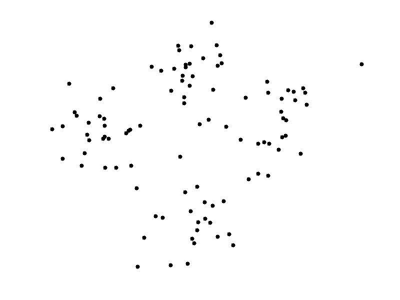
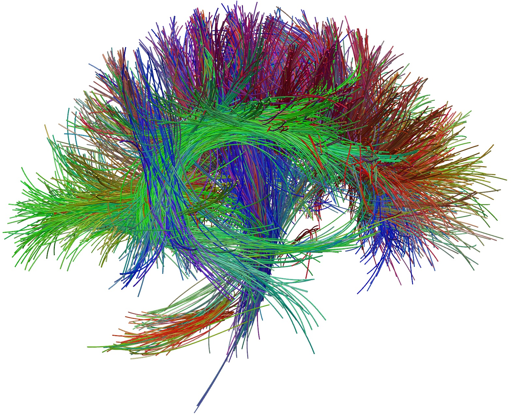
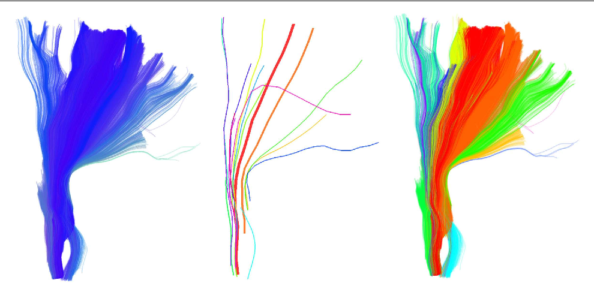
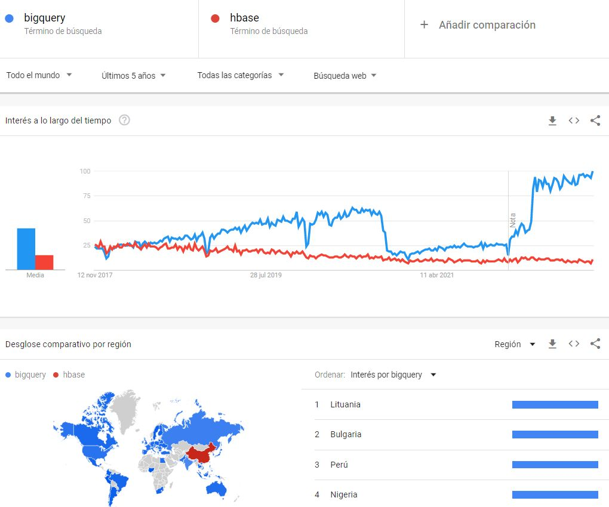
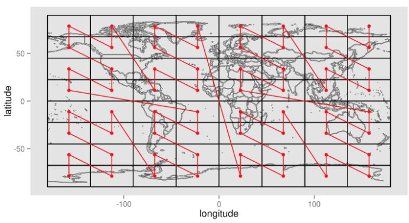
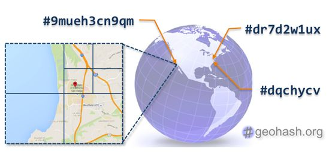
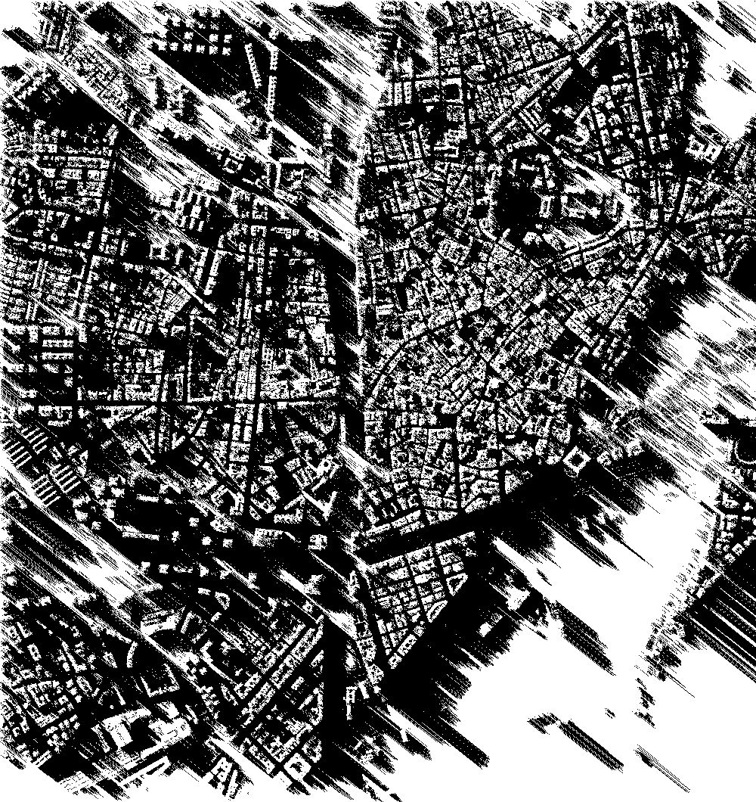

___
# Lesson 5.1 Clustering

## Introducción

El clustering es un conjunto de procesos o algoritmos que tiene como objetivo agrupar individuos para crear subconjuntos de datos. Cada uno de ellos recibe el nombre de clúster. Un clúster es, por tanto, una colección de objetos o datos que guardan similitudes entre ellos. Sin embargo, también tienen las suficientes características diferenciadoras respecto al resto de los elementos como para justificar la creación de un segmento independiente. El clustering, evidentemente, puede aplicarse a datos georeferenciados siendo lo más común, en este caso, que el criterio de similitud tenga una relación directa o indirecta con la posición geográfica. 

Una implementación, en Python y en C++, se encuentra autodescrita en el [notebook](./k-means_noGeo/k-means.ipynb).

La siguiente animación muestra gráficamente el mecanismo iterativo de k-means:

<br/><br/>
<p style='text-align:center;'></p>

En esta lección, como ya anticipamos, vamos a implementar un algoritmo de clustering aplicado a los datos procedentes de l proyecto [UmaSmartDrive](https://eventos.uma.es/29987/detail/u-smart-drive-i-plan-propio-de-smart-campus.html). En el proyecto aplicaremos una modificación del algoritmo _k-means_ (ver [PowerPoint](../lesson%20geo%204/05-Kmeans.pptx)) adaptada a los trayectos realizados por los vehículos que acceden al campus de Teatinos, para identificar trayectos que tengan un trazado similar _dentro del campus_.

La idea en concreto es es localizar vehículos y conductores que hacen el mismo trayecto para acceder al campus o para salir de él con el objeto de identificar sus patrones de conducción mediante el análisis de series temporales.

En la siguiente imagen vemos un resultado, que se ha obtenido utilizando una versión del algoritmo k-means(Quickbundles), implementado en Python, a partir de una colección de trayectos de la que se han obtenido cinco clusters.


El código, como se comentó en la clase anterior:

1. Consulta los trayectos en una base de datos
2. Consulta en la BD los datos de los puntos registrados en cada trayecto
3. Asocia los correspondientes puntos a los trayectos mediante punteros
4. Clasifica los trayectos en:

    * Entra en el campus
    * Salen del campus
    * Es interior
    * Sólo pasan por el campus
    * No pasan por el campus

Si los trayectos tienen suficiente calidad (un mínimo nº de puntos), los redefine con exactamente 256 puntos
Los 256 puntos son equidistantes en espacio (no en tiempo)
Los parámetros del nuevo punto se obtienen mediante media ponderada de los puntos ya existentes, en tiempo.

Existen dos versiones del código: la primera, más simpe, e ineficiente, en Python, así como una versión mucho más compleja en C++, que es la que se debe completar en la práctica.

<br/>

---
## Versión Python

La versión en Python utiliza el algoritmo Quickbundles, que se ha implementado en la librería de imágenes médicas DipY para Python para resolver un problema diferente: la simplificación de tractos en una tractografía:

La Tractografia es una técnica de resonancia magnética avanzada, con la cual se evidencian los tractos neuronales, es decir las redes  e interconexiones nerviosas del cerebro (sustancia blanca) entre los hemisferios cerebrales, cerebelo, tronco raquídeo y sus conexiones con la médula espinal. Se lleva a cabo mediante resonancia magnética.

En un [famoso artículo](https://doi.org/10.3389/fnins.2012.00175) se describe el algoritmo Quickbundles, que no es más que una aplicación concreta del algoritmo k-means adaptada a trayectos, en lugar de puntos. La hemos utilizado en nuestro proyecto como modelo.




El método es relativamente fácil de reproducir y adaptar a nuestro problema. Puede encontrar el [código](./k-means_geo_py/pypostgis.py), y su descripción en un [notebook](./k-means_geo_py/k-means_obd.ipynb) en los enlaces.

<br/>

---
## Versión C++

La versión en C++ mejora significativamente el rendimiento del algoritmo, no solo por el simple hecho de no utilizar un lenguaje interpretado, sino también porque es suceptible de ser paralelizado. Además, hay partes del código vectorizables y susceptibles de alcanzar un buen rendimiento en GPUs.

Entre las operaciones vectorizables están:

*Cálculo de la distancia entres dos trayectos*:  
Media aritmética de los distancia entre los correspondientes 256 puntos de cada uno de ello

*Cálculo del "Centroide de N trayectos"*:  
Es un trayecto formado por los 256 centroides de los correspondientes puntos de N trayectos diferentes.

En la siguiente imagen se muestra el trayecto centroide (C) de 5 trayectos (0 a 4):


Para este mismo ejemplo, se muestran algunas "distancias" entre trayectos:

* Distancia entre 1 y 4 es 719 metros
* Distancia entre 1 y 2 es 1328 metros (aunque sean parecidos, el sentido de circulación es opuesto)
* Distancia entre 1 y C es 437 metros
* Distancia entre 0 y 3 es 125 metros
* Distancia entre 0 y C es 1190 metros

## Clases en el código c++

Se muestran a continuación algunas de las clases, estructuras y headers usados por el código:

### samples (muestras)

Es la información del OBD capturada en un determinado punto:

```c
struct sample
{
	int idtrip;
	double time;
	double co2perkm;
	double intakeairtemp;
	double litres100km;
	double vehspeed;
	double hdop;  //horizontal dilution of precision 
	double gpsbearing;
	double throttle;
};
```

### Clase trippoint

Es, junto a tripline, una de las dos clases críticas:

```c

class trippoint
{
public:
	//Basic information
	sample *sample; //From database
	int numorder;
	double latitude;
	double longitude;
	bool hasdata = false;   //Sample data found

	//Advanced information (after processig)
	bool gps_ok = true;      //Valid GPS measure
	double gpsspeed;		 //Computed GPS speed, considering GPS data
	double time_weight = 0;  //proximity to prior (1: very close to i-1)
	double space_weight = 0; // (0: very close to i+1)
	double newlat;           //Corrected GPS data (if no ok)
	double newlon;

	//Constructors
	trippoint(double lat, double lng);
	trippoint(trippoint *s, trippoint *d, double w); //From interpolation
	trippoint(trippoint *s);   //Copy
	~trippoint();
};

	trippoint::trippoint(double x, double y)
	{
		latitude = y;
		longitude = x;
	};
	trippoint::trippoint(trippoint *s, trippoint *d, double w)
	{
		newlat=latitude = s->newlat + w*(d->newlat - s->newlat);
		newlon=longitude = s->newlon + w*(d->newlon - s->newlon);
		//ToDo Interpolate more parameters ?
	};
	trippoint::trippoint(trippoint *s)
	{
		newlat=latitude = s->newlat;
		newlon=longitude = s->newlon;
	};
	trippoint::~trippoint()
	{

	}
```

### Clase tripline

Básicamente es un conjunto de objetos trippoint, aunque tiene implementado numerosos métodos:

```c
class tripline
{

public:
	int id;
	trippoint **points;
	double distance1;
	double distance2;
	int npoints;

	bool outgoing = false;
	bool ingoing = false;
	bool invalid = false;
	int first, last; //First and last ok points
	double newdistance;
	bool verbose = true;

	tripline();
	~tripline();
	void fill(int npoints);
	bool insideCampus(int pointindex);
	void classify();
	void interpolation(int source, int destination);
	void computeGPSspeed();
	void filterStep1();
	void filterStep2();
	void maketrack256(tripline * newtrack);
};

double distance(tripline *a, tripline *b);
double distance(trippoint b, trippoint a);
double distance(double latb, double lata, double lonb, double lona);

```


¿Y qué tengo que hacer?


Se adjunta el mismo proyecto para dos entornos (ver enlace al final), y se recomienda comprobar que se puede compilar y lanzar al menos uno de ellos antes de la clase.


Visual Studio 2022 (Windows)
Para compilar con las librerías GDAL y PostgreSQL, se debe instalar QGIS (preferible 3.28), ya que se utilizan los directorios:


c:\Program Files\QGIS 3.28\include (para los header)
c:\Program Files\QGIS 3.28\lib (librerías)
c:\Program Files\QGIS 3.28\bin (Dlls)


...aunque se puede adaptar a otras versiones inferiores o posteriores fácilmente.


Para ejecutar fuera de las plataformas, se necesita añadir el directorio bin de QGIS al PATH, o copiar todas las dlls. En Windows:

set Path=c:\Program Files\QGIS 3.28\bin;%Path%


Finalmente, para la ejecución es necesario el acceso a una copia local de la base de datos, o mediante un túnel 


del puerto local 5432 
al servidor destino obd.ac.uma.es:5432
utilizando el acceso ssh aa00@login.ac.uma.es:22 o similar
set Path="c:\Program Files\QGIS 3.16\lib";%Path%

Haz clic [aquí](./postgiscpp/) para ver el proyecto c++.

<br/><br/>
___
# Lesson 5.2 Miscellany

## Dataframes de Geopandas y GDAL

En este anexo se muestra un ejemplo de uso de los dataframes de geopandas (que no son más que tablas de datos en Python, similares a _pandas_, pero georeferenciadas).

El ejemplo también utiliza la librería Shapely de Python, enfocada a la manipulación y el análisis de datos vectoriales. Tanto Shapely en Python, sf en R, y PostGIS utilizan la misma librería en backend: [GEOS](https://libgeos.org/).

Toda la documentación de este anexo está en el [notebook](./geopandas_gdal/acceso_gdal_geopandas.ipynb) de Jupyter donde se desarrolla un ejemplo. 

Adicionalmente se muestra el interfaz que permite conectar directamente Python con la librería GDAL.


<br/><br/>
___
## Otras bases de datos geográficas
___
### BigQuery GIS

BigQuery es el almacén de datos empresariales de Google. De gran escalabilidad y sin servidor, está diseñado para mejorar la productividad de los analistas de datos con un precio relativamente bajo. Como no hay que gestionar ninguna infraestructura, puedes centrarte en analizar los datos mediante un lenguaje SQL y sin necesidad de administrador la bases de datos.

Además, BigQuery tiene implementada algunas características GIS, aunque con ciertas limitaciones. Puedes encontrar más información en la sección [BigQuery GIS](https://cloud.google.com/bigquery/docs/geospatial-intro?hl=es-419) de la documentación oficial.

La visualización de datos se realiza a través de visores para GeoJSON, por ejemplo, con la [extensión para geojson de Jupyter](https://github.com/jupyterlab/jupyter-renderers/tree/master/packages/geojson-extension)

El siguiente [Notebook Jupyter](./bigquery/bigquery.ipynb) muestra gráficamente cómo se realiza una consulta en BigQuery. Sin embargo, para evitar problemas de la instalación de Python establecida para trabajar con QGIS (fijada en el archivo [.env](../.env) del proyecto github), usaremos la instalación del sistema, que en mi caso se inicia con "d:\proyectos\python310\python.exe -m notebook --debug


Finalmente, puede consultar los tutoriales de Google [Comienza a usar las estadísticas geoespaciales](https://cloud.google.com/bigquery/docs/geospatial-get-started?hl=es-419) y [Trabaja con datos geoespaciales](https://cloud.google.com/bigquery/docs/geospatial-data?hl=es-419), en los que descubrirá la similitud con PostGIS, ya que la diferencia principal radica en el rendimiento con grandes datos (y en el coste, por supuesto).

<br/><br/>
___
### Análisis geoespacial con bases de datos NoSQL: HBase y Cassandra

Además de BigQuery, hay otros ejemplos de bases de datos orientado al bigdata: HBase y Cassandra, ambas desarrolladas por Apache. HBase, por ejemplo, se autodefine como una "base de datos NoSQL de código abierto para Hadoop". En concreto, las principales características de HBase son:

* Open source Apache project
* Non-relational, distributed DB
* Runs on top of HDFS
* Written in Java
* NoSQL (Not Only SQL) Database
* Consistent and Partition tolerant
* Runs on commodity hardware
* Large Database ( terabytes to petabytes).
* Low latency random read / write to HDFS.
* Many companies are using HBase
* Facebook, Twitter, Adobe, Mozilla, Yahoo

Sin embargo, a pesar de sus ventajas...

<p style='text-align:center;'></p>

Aunque estas bases de datos (HBase, Cassandra, ...), por su simplicidad, no tienen componentes geosespaciales específicas, se apoyan en Geomesa: 

GeoMesa es una base de datos espaciotemporal, distribuida y open-source construida sobre una serie de sistemas distribuidos de almacenamiento de datos en la nube, incluyendo HBase, Cassandra y Bigtable. Aprovechando una estrategia de indexación altamente paralelizada, GeoMesa tienen como objetivo proporcionar a los sistemas distribuidos de almacenamiento consultas espaciales y manipulación de datos. En cierto sentido, no es incorrecto decir que Geomesa es a HBase o Cassandra lo que PostGIS a Postgresql.

Una gran parte de la potencia de Geomesa se obtiene gracias a su eficiente manipulación de los datos mediante un indexado de los mismos usando índices Z, que no es más que una forma de referenciar datos geométricos o geográficos mediante un sistema alternativo a los conocidos X e Y o latitud y longitud:

<p style='text-align:center;'></p>

El orden Z (desarrollado por Morton, de IBM, en Canadá en 1966) puede extenderse a otras dimensiones, y utiliza un valor binario para indicar la posición en las dos (o más) dimensiones:

<p style='text-align:center;'></p>

Una adaptación del índice Z a datos geoespaciales es conocido como Geohash. Un geohash es un sistema de geocódigos del dominio público creado por Gustavo Niemeyer en el 2008 en donde se codifica la ubicación geográfica en un texto corto de letras y números. El fundamento es muy parecido al índice Z, aunque utiliza símbolos alfanuméricos. 

<p style='text-align:center;'></p>


Es fácil observar en esta tabla cómo el índice geohash se relaciona con la escala y la localidad espacial de los datos a los que indexa:

* Sur de europa, norte de África: e
* España: ey
* Málaga: eysb
* El Palo: eysbuu
* Pedregalejo: eysbuh
* Aeropuerto JFK: dr5x0z

<p style='text-align:center;'></p>

En la siguiente animación se muestra dinámicamente el indexado en Geomesa mediante el índice Z:

<p style='text-align:center;'></p>


<br/><br/>
___
## Una simulación MonteCarlo con datos geoespaciales 

En [este anexo](./montecarlo/README.md) se desarrolla un ejemplo de una simulación MonteCarlo para la estimación  de la radiación solar en los tejados de una ciudad. La simulación utiliza datos de LiDAR, obtenidos a partir de una capa raster de un servicio del [Centro Nacional de Información Geográfica](http://centrodedescargas.cnig.es/CentroDescargas/catalogo.do?Serie=MDT02#), para calcular la radiación en la superficie de los techos de edificios en la ciudad de Málaga.


<br/>
<p style="text-align: center;">
[]
</p>

A partir de los resultados, puede calcularse la posición y orientación más adecuada para los paneles solares:

<br/>
<p style="text-align: center;">
[]
</p>


Nota 2022 (para el profesor): El código Python falla por las dimensiones del modelo ASC descargado del IGN (hoja 1053). La depuración se hace en VSCode, pero en una ventana diferente del workspace, ya que el entorno .env está configurado para pyqgis. 


