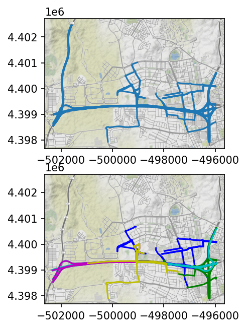
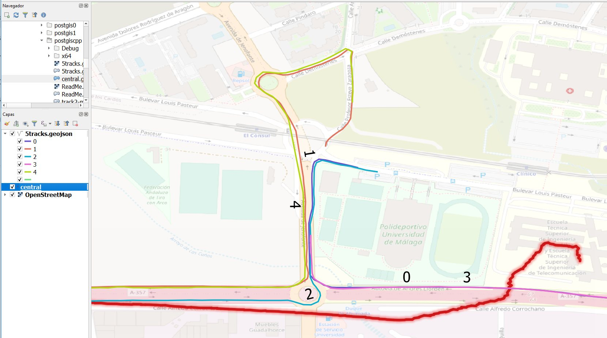

___
# Lesson 5.1 Clustering

## Introducción

En el proyecto aplicaremos una modificación del algoritmo [k-means](../lesson%20geo%204/05-Kmeans.pptx) adaptada a los trayectos realizados por los vehículos que acceden al campus de Teatinos.

La idea es localizar vehículos que hacen el mismo trayecto para acceder al campus o para salir de él.
A continuación, se ve el resultado, que se ha obtenido utilizando una versión del algoritmo (Quickbundles), implementado en Python, a partir de una colección de trayectos de la que se han obtenido cinco clusters.

El código, como se comentó en la clase anterior:

1 Consulta los trayectos en una base de datos

2 Consulta en la BD los datos de los puntos registrados en cada trayecto

3 Asocia los correspondientes puntos a los trayectos mediante punteros

4 Clasifica los trayectos en:

    * Entra en el campus
    * Salen del campus
    * Es interior
    * Sólo pasan por el campus
    * No pasan por el campus

Si los trayectos tienen suficiente calidad (un mínimo nº de puntos), los redefine con exactamente 256 puntos
Los 256 puntos son equidistantes en espacio (no en tiempo)
Los parámetros del nuevo punto se obtienen mediante media ponderada de los puntos ya existentes, en tiempo.

Además, en la nueva versión que os adjunto, he añadido dos interesantes operaciones:

*Cálculo de la distancia entres dos trayectos*:  
Media aritmética de los distancia entre los correspondientes 256 puntos de cada uno de ello

*Cálculo del "Centroide de N trayectos"*:  
Es un trayecto formado por los 256 centroides de los correspondientes puntos de N trayectos diferentes.

En la siguiente imagen se muestra el trayecto centroide (C) de 5 trayectos (0 a 4):

En la siguiente imagen se muestra el trayecto centroide (C) de 5 trayectos (0 a 4):

Para este mismo ejemplo, se muestran algunas "distancias" entre trayectos:

Distancia entre 1 y 4 es 719 metros
Distancia entre 1 y 2 es 1328 metros (aunque sean parecidos, el sentido de circulación es opuesto)
Distancia entre 1 y C es 437 metros
Distancia entre 0 y 3 es 125 metros
Distancia entre 0 y C es 1190 metros

¿Y qué tengo que hacer?

Se adjunta el mismo proyecto para dos entornos (ver enlace al final), y se recomienda comprobar que se puede compilar y lanzar al menos uno de ellos antes de la clase.

Visual Studio 2019 (Windows)
VSCode, (preparado para usar el compilador y depurador de Visual Studio)
Para compilar con las librerías GDAL y PostgreSQL, se debe instalar QGIS (preferible 3.16), ya que se utilizan los directorios:

c:\Program Files\QGIS 3.16\include (para los header)
c:\Program Files\QGIS 3.16\lib (librerías)
c:\Program Files\QGIS 3.16\bin (Dlls)

...aunque se puede adaptar a otras versiones inferiores o posteriores fácilmente.

Para ejecutar fuera de las plataformas, se necesita añadir el directorio bin de QGIS al PATH, o copiar todas las dlls. En Windows:

set Path=c:\Program Files\QGIS 3.16\bin;%Path%

Finalmente, para la ejecución es necesario el acceso a una copia local de la base de datos, o mediante un túnel 

del puerto local 5432 
al servidor destino obd.ac.uma.es:5432
utilizando el acceso ssh aa00@login.ac.uma.es:22 o similar
set Path="c:\Program Files\QGIS 3.16\lib";%Path%

Haz clic [aquí](./postgiscpp/) para ver el proyecto c++.

  
___
# Lesson 5.2 Miscellany

